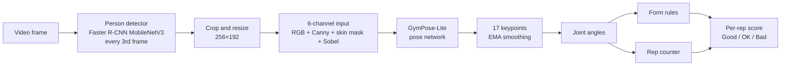

# GymPose-Lite

Gym exercise form feedback from video: a 9M-parameter pose network distilled from a 59M-parameter KeypointRCNN teacher, with joint-angle form checks, rep counting and a Flask upload app.

## What it does

- Takes a video of a **squat, deadlift or push-up** and locates the lifter with a person detector.
- Estimates the 17 COCO body keypoints in every frame with a small pose network and smooths them over time.
- Computes knee, elbow, hip and back angles, checks them against rule-based form thresholds, counts reps and scores each rep as Good, OK or Bad.
- Wraps it all in a Flask web app: upload a video, pick the exercise, and get back an annotated video plus videos of the intermediate stages (Canny edges, skin mask, Sobel gradient, keypoint heatmaps, CNN feature maps). Processing runs as a background job and the page polls for progress.

## How it works

### Pipeline



1. **Detection.** torchvision's Faster R-CNN MobileNetV3-Large FPN finds the largest person every 3rd frame. The box is padded by 20% and reused between detections.
2. **Input channels.** The crop is resized to 256×192, and three classical image-processing channels are computed from it: Canny edges, an HSV skin mask and Sobel gradient magnitude. These are stacked with the normalised RGB image into a 6-channel input.
3. **Pose network.** GymPose-Lite predicts 17 keypoint heatmaps and coordinates (architecture below).
4. **Smoothing.** Keypoints are smoothed across frames with an exponential moving average (α = 0.6).
5. **Form and reps.** Joint angles drive rule-based checks for each exercise, such as squat depth and forward lean, push-up hip sag, and deadlift back angle. A four-state rep counter (standing, descending, bottom, ascending) with 8° hysteresis counts reps, and each completed rep is scored Good, OK or Bad from the form feedback raised during it.

`demo.py` and `process_video.py` render an 8-panel view of every stage: the input with the detector box, Canny edges, the HSV skin mask, the Sobel gradient, the 17 heatmaps, the skeleton overlay, form analysis with the rep count, and CNN feature activations.

### Model architecture

| Stage | Details | Output for a 256×192 crop |
|---|---|---|
| Input | Normalised RGB + Canny edges + HSV skin mask + Sobel magnitude | 6 × 256 × 192 |
| Backbone | MobileNetV3-Large (ImageNet-pretrained). The first conv is widened from 3 to 6 input channels and keeps its pretrained RGB weights | 960 × 8 × 6 |
| Upsampling | 3 × transposed conv (4×4, stride 2) + BatchNorm + ReLU | 256 × 64 × 48 |
| Heatmap head | 1×1 conv + sigmoid | 17 × 64 × 48 |
| Soft-argmax | Expected (x, y) position of each heatmap | 17 × 2 |
| Graph refinement | 1-layer graph convolution over the 16 skeleton bones that adds a residual offset to the coordinates | 17 × 2 |

**Total: 9,012,083 parameters**, about 6.5× fewer than the teacher (~59.1M).

### Training: pseudo-label distillation

The first approach was direct training. Four runs (~41 GPU-hours) plateaued, with validation loss flat for 80+ epochs, so the final model was trained on pseudo-labels from a much larger teacher instead:

1. **Teacher labelling.** torchvision's KeypointRCNN-ResNet50-FPN (~59.1M parameters) was run on 149,813 COCO train2017 person instances, each cropped and resized to 256×192. Joints predicted with confidence ≥ 0.5 were kept, and crops with at least 5 such joints were saved. The result was **148,238 labelled crops**, generated in about 6 hours on an RTX 3060 Laptop GPU.
2. **Targets.** The teacher's keypoints were re-drawn as Gaussian heatmaps (σ = 3) on a 64×48 grid, alongside normalised coordinates.
3. **Student training.** The student is trained on these hard pseudo-labels with heatmap MSE + 5.0 × coordinate L1 loss.

## Results

| Metric | Value |
|---|---|
| Median joint error vs. teacher (14,824 held-out crops) | **20.9 px** |
| Mean joint error vs. teacher | 36.3 px |
| Joints within 20 px of the teacher | 48.9% |
| Parameters | 9,012,083 (teacher ~59.1M) |
| Pose network latency, RTX 3060 Laptop GPU | ~11 ms / frame |
| Pose network latency, Ryzen 5 5600H CPU | ~31 ms / frame (~30 FPS) |
| Full app throughput on uploaded 1080p video | ~7.5 FPS (offline processing) |

- Accuracy is measured **against the teacher's pseudo-labels, not COCO ground truth**, on a random 10% split held out from the distillation set. Errors are in pixels of the 256×192 input crop. COCO AP and PCK have not been measured yet.
- Latency covers the pose network only (batch 1, fp32). The full app adds the person detector, visualisation and H.264 encoding, and is not real-time.

## Quickstart

You need Python 3 (developed on 3.12) and `ffmpeg` on your `PATH`. The web app uses `ffmpeg` to re-encode its outputs to H.264. A CUDA GPU is optional.

**1. Install**

```bash
git clone https://github.com/ArnavSinha717/GymPose-Lite.git
cd GymPose-Lite
python -m venv .venv
source .venv/bin/activate          # Windows: .venv\Scripts\activate
pip install -r requirements.txt    # for a specific CUDA build of PyTorch, see pytorch.org
```

**2. Download the trained weights** (`distill_test.pth`, ~36 MB, from the [v1.0 release](https://github.com/ArnavSinha717/GymPose-Lite/releases/tag/v1.0)) into `checkpoints/`:

```bash
mkdir -p checkpoints
curl -L -o checkpoints/distill_test.pth \
  https://github.com/ArnavSinha717/GymPose-Lite/releases/download/v1.0/distill_test.pth
```

torchvision downloads the person detector's COCO weights automatically on first use.

**3. Run the web app** from the repository root:

```bash
python app.py
```

Open <http://localhost:5000>, upload a video, choose Squat, Deadlift or Push-up, and press Process.

**Live demo (webcam or video file).** This opens the 8-panel window. `--use-cv` is required for the released 6-channel checkpoint.

```bash
python demo.py --checkpoint checkpoints/distill_test.pth --use-cv                       # webcam 0
python demo.py --checkpoint checkpoints/distill_test.pth --use-cv --video path/to/clip.mp4
```

Keys: `1` squat, `2` push-up, `3` deadlift, `q` quit. Other options: `--camera N`, `--no-detector`, `--config PATH`.

**Render a video offline:**

```bash
python process_video.py --input path/to/clip.mp4 --exercise squat --use-cv
```

This writes `path/to/clip_processed.mp4` with the 8-panel view. Options: `--output PATH`, `--checkpoint PATH` (default `checkpoints/distill_test.pth`), `--exercise {squat,pushup,deadlift}`, `--detect-every N` (default 3).

**Retrain (optional):**

```bash
bash data/download_coco.sh    # COCO 2017 (~19 GB) into ~/GymPose-Lite/datasets/coco
python generate_teacher.py --coco-root ~/GymPose-Lite/datasets/coco --output datasets/teacher_heatmaps
python train_distill.py --data datasets/teacher_heatmaps --use-cv --epochs 50
```

`train_distill.py` holds out a random 10% split, prints pixel-error metrics after every epoch and saves to `checkpoints/distill_test.pth`, overwriting the downloaded weights. `run_full_distill.sh` waits for a running teacher-generation job and then starts distillation. Both shell scripts use hard-coded `~/GymPose-Lite` paths.

## Project structure

```
GymPose-Lite/
├── app.py                 Flask app: upload, background processing jobs, status polling
├── demo.py                Live 8-panel demo for a webcam or video file
├── process_video.py       Renders the 8-panel view to an MP4
├── generate_teacher.py    Teacher pseudo-labels for COCO person crops
├── train_distill.py       Student training on the pseudo-labels
├── train.py               Direct training on COCO / gym keypoints (earlier approach)
├── evaluate.py            COCO AP evaluation (3-channel models only, see Limitations)
├── test_demo.py           Single-image pipeline test (older 3-channel checkpoint)
├── run_full_distill.sh    Starts distillation once teacher generation finishes
├── setup_windows.bat      Windows dependency installer
├── configs/default.yaml   Dataset, skeleton, training and demo settings
├── models/                Backbone, upsampling head, pose head, graph refinement
├── feedback/              CV channels, joint angles, form rules, rep counter and scorer
├── viz/                   Heatmap, feature-map and multi-panel rendering
├── data/                  Dataset loaders (COCO, gym, teacher pseudo-labels) and COCO download script
└── templates/index.html   Web UI
```

## Limitations

- **No ground-truth evaluation yet.** Accuracy is measured only against the teacher's pseudo-labels. That shows how closely the student matches the teacher, not how accurate either model is on human annotations. COCO AP and PCK have not been measured.
- **`evaluate.py` is out of date.** It still builds a 3-channel model, so it cannot load the final 6-channel checkpoint. `test_demo.py` also targets the older 3-channel checkpoint.
- **No ablations.** The effect of the extra Canny/skin/Sobel input channels and of the graph-refinement step has not been measured.
- **Rule-based feedback.** Form checks are fixed thresholds on 2D joint angles, not learned. Only the largest detected person is tracked.
- **Not real-time end to end.** The pose network alone runs at ~30 FPS on a laptop CPU, but the full app processes uploaded video offline at about 7.5 FPS.

## Credits

Course project for Machine Vision at VIT Vellore (2026) by **Arnav Sinha** and **Shivam Bhansali**.

Built with PyTorch and torchvision. The teacher (KeypointRCNN-ResNet50-FPN), the person detector (Faster R-CNN MobileNetV3-Large FPN) and the ImageNet-pretrained MobileNetV3-Large backbone weights come from torchvision. Training crops come from the COCO 2017 keypoints dataset.

## License

Released under the [MIT License](LICENSE).
